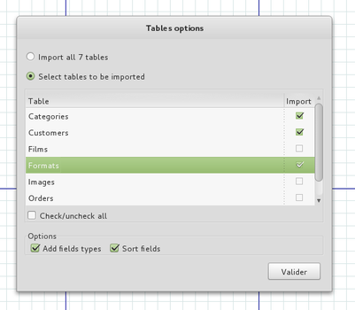

# Dia Sql Import Plugin

Plugin to selectively import PostgreSql tables to a Dia schema.

The goal of this tool is not to be a full UML DB tool; tere's a lot of great tools for that.
This tool is designed to help generate schemas of large databases where Foreign Keys are not always present.

## Features

  * Select tables to import

## Installation

Simply put `sql_import.py` into your `~/.dia/python` directory (adapt it for non-Linux OS).

## Usage

Lunch script from `Tools` menu: Tools > SqlImport

## Found a bug ?

Run dia from command line and **copy/paste trace** to bug request.

## TODO

  * add relations between tables
  * support for other databases types (if you need it, make a pull request, or a fill a bug if you're not in a hurry !)